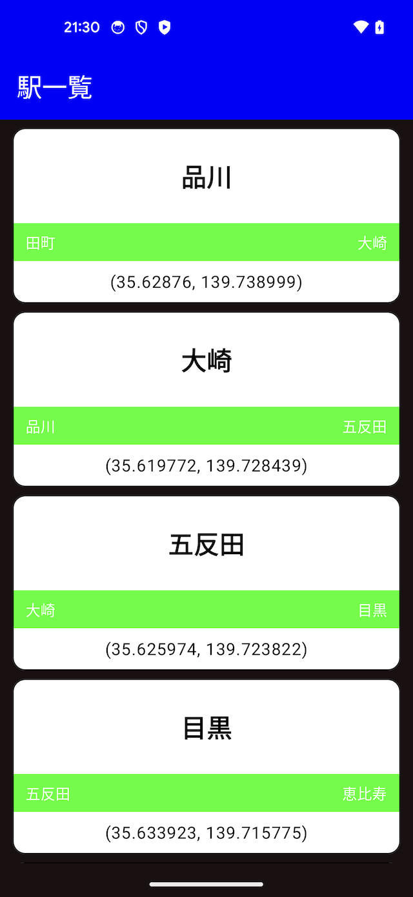
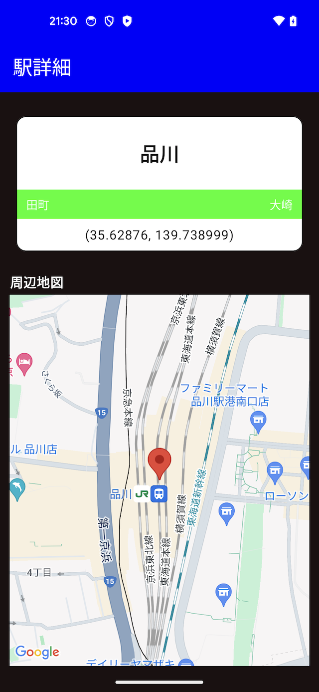

# StationInfoApp

## このアプリについて

- 自身の学習用に作成したアプリです。特に有用な機能も備えておらず、Google Play等で公開する予定もありません
- 一覧から任意の項目を選択するのを繰り返すことで、地域〜都道府県〜路線〜駅の順にドリルダウンで確認するという流れで構成しています
- 株式会社ハートレイルズ様が公開されているAPIを使用しております
  - [ハートレイルズ社のOHP](https://www.heartrails.com/ja)
  - [HeartRails Express API仕様](https://express.heartrails.com/api.html)

## 追記

- Googleマップを使っています
  - Maps SDKのAPIキーは `@string/google_map_api_key` に定義していますが、Gitの管理下には入れていません
  - 当コードの動作を確認される場合は、自身でAPIキーを取得したうえで string リソースに追加して下さい
- 駅一覧では駅名標よろしく横線に色をつけていますが、元ネタは[こちら](https://ja.wikipedia.org/wiki/日本の鉄道ラインカラー一覧)です

## スクリーンショット

- 端末はPixel5、OSバージョンはAndroid14です
- 全てダークモードで撮影しています

| 地域一覧 | 都道府県一覧 | 路線一覧 | 駅一覧 | 駅詳細 |
| :---: | :---: | :---: | :---: | :---: |
|  |  |  |  |  |